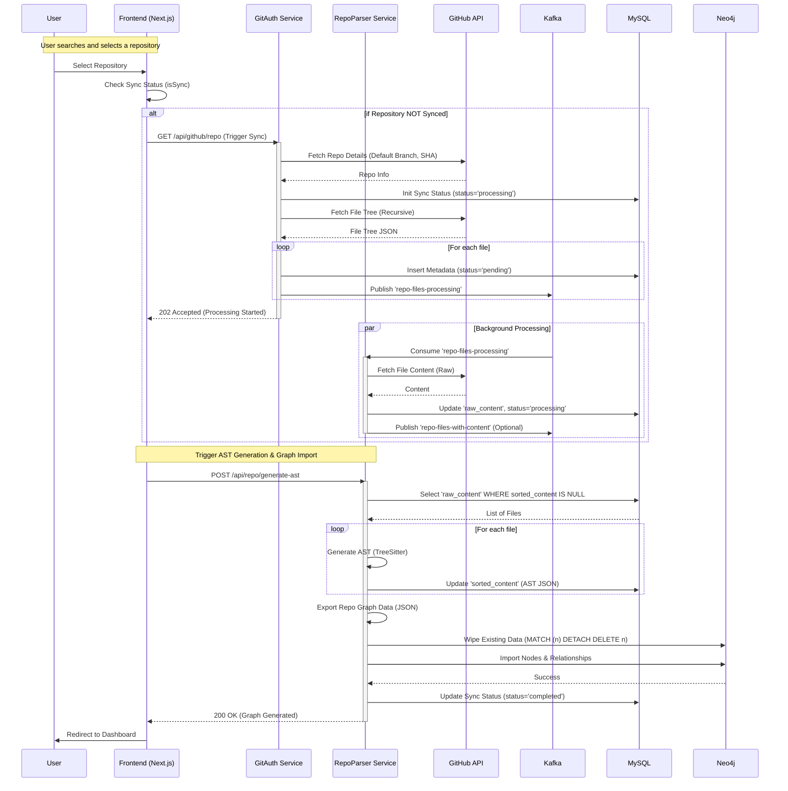

# Project Pipeline Sequence Diagram

This diagram visualizes the end-to-end flow of the CodeAtlas project pipeline, initiated by a user selecting a repository in the frontend.

```mermaid
sequenceDiagram
    participant User
    participant FE as Frontend (Next.js)
    participant GA as GitAuth Service
    participant RP as RepoParser Service
    participant GH as GitHub API
    participant KA as Kafka
    participant MS as MySQL
    participant N4 as Neo4j

    Note over User, FE: User searches and selects a repository

    User->>FE: Select Repository
    FE->>FE: Check Sync Status (isSync)

    alt if Repository NOT Synced
        FE->>GA: GET /api/github/repo (Trigger Sync)
        activate GA
        GA->>GH: Fetch Repo Details (Default Branch, SHA)
        GH-->>GA: Repo Info
        GA->>MS: Init Sync Status (status='processing')
        
        GA->>GH: Fetch File Tree (Recursive)
        GH-->>GA: File Tree JSON
        
        loop For each file
            GA->>MS: Insert Metadata (status='pending')
            GA->>KA: Publish 'repo-files-processing'
        end
        
        GA-->>FE: 202 Accepted (Processing Started)
        deactivate GA

        par Background Processing
            KA->>RP: Consume 'repo-files-processing'
            activate RP
            RP->>GH: Fetch File Content (Raw)
            GH-->>RP: Content
            RP->>MS: Update 'raw_content', status='processing'
            RP->>KA: Publish 'repo-files-with-content' (Optional)
            deactivate RP
        end
    end

    Note over FE, RP: Trigger AST Generation & Graph Import

    FE->>RP: POST /api/repo/generate-ast
    activate RP
    RP->>MS: Select 'raw_content' WHERE sorted_content IS NULL
    MS-->>RP: List of Files

    loop For each file
        RP->>RP: Generate AST (TreeSitter)
        RP->>MS: Update 'sorted_content' (AST JSON)
    end

    RP->>RP: Export Repo Graph Data (JSON)
    
    RP->>N4: Wipe Existing Data (MATCH (n) DETACH DELETE n)
    RP->>N4: Import Nodes & Relationships
    N4-->>RP: Success

    RP->>MS: Update Sync Status (status='completed')
    RP-->>FE: 200 OK (Graph Generated)
    deactivate RP

    FE->>User: Redirect to Dashboard
```
